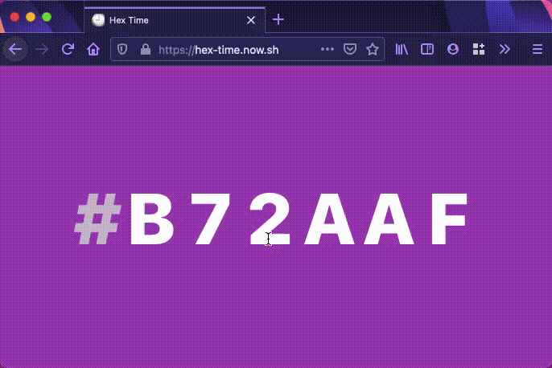

# [Hex Time](https://hex-time.now.sh/)

> 🕘 Time as a color

<p align="center">
  
</p>

## ⚙️ Build setup

This project was bootstrapped with [Create React App](https://github.com/facebook/create-react-app).

Clone or fork the repository then run

```bash
yarn
yarn start
```

to start a development server.

Run `yarn build` to compile and build the web app.

### Hosting

- Development: `vc`
- Production: `vc --prod`

## Extension

Create a `.env file`:

```env
INLINE_RUNTIME_CHUNK=false
```

Run `yarn build`, then load the `build/` directory as an unpacked extension.

### TS errors

- Reload VScode so it can detect changes
- Set `"jsx": "react"`

  ```json
  {
    "compilerOptions": {
      "jsx": "react"
    }
  }
  ```

## 📜 License

MIT
